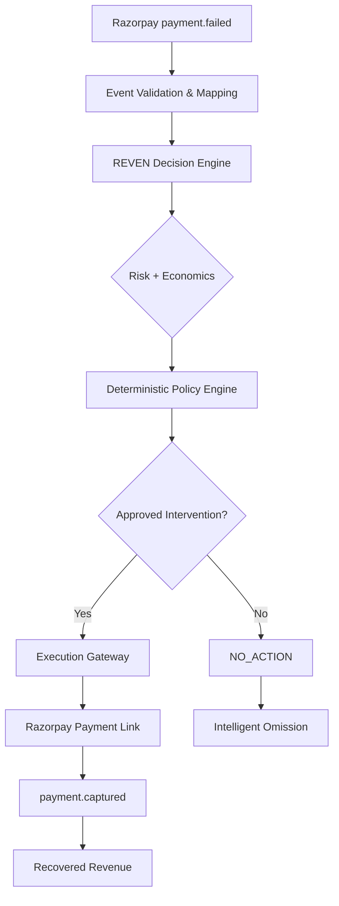

# REVEN
**Revenue Recovery Agent**

REVEN is a professional-grade Revenue Recovery Agent for subscription businesses. Unlike traditional recovery systems that rely on blind retries, REVEN treats recovery as an economic decision problem.

> **Core Thesis:** "Revenue decisions, not payment retries."

REVEN evaluates every failed subscription payment by analyzing customer state, risk, and recovery economics to determine the most profitable action—including the deliberate choice to take no action.

---

## 🎯 Why REVEN?

Traditional recovery systems typically follow a rigid "retry loop" (e.g., try every 3 days for 30 days). This approach has two critical flaws:
1. **Economic Blindness:** It ignores the cost of intervention (SMS, Email, Agent time) and the risk of alienating a high-value customer.
2. **Inefficiency:** It treats all failed payments the same, regardless of whether the failure was a transient card issue or a sign of intent to churn.

**REVEN's Approach**: REVEN models the expected value of every possible recovery intervention. It only acts when the expected incremental net revenue justifies the cost, transforming recovery from a cost-center into a precision profit-engine.

---

## ⚙️ The Core Idea: SEE → THINK → DECIDE → ACT → RECOVER

REVEN operates as a deterministic state machine powered by grounded AI intelligence.

| Stage | Process | Description |
| :--- | :--- | :--- |
| **SEE** | Event Validation | Captures `payment.failed` events from Razorpay and maps them to internal customer states. |
| **THINK** | Economic Analysis | Evaluates risk signals and computes the expected value of various recovery interventions. |
| **DECIDE** | Policy Enforcement | Applies deterministic gates (minimum uplift, risk thresholds) to authorize a specific action. |
| **ACT** | Execution Gateway | Executes the approved intervention (e.g., generating a Razorpay Payment Link). |
| **RECOVER** | Outcome Tracking | Confirms revenue recovery only upon receiving a `payment.captured` event. |

---

## 🚀 What REVEN Does

- **Failed Payment Analysis**: Deep dive into why a payment failed and the customer's historical health.
- **Customer Risk Evaluation**: Uses risk signals to calibrate the aggressiveness of the recovery.
- **Recovery Economics**: Computes expected net revenue for each possible intervention.
- **Deterministic Policy**: Ensures consistent, audit-able decisions based on hard economic constraints.
- **Intelligent Omission (`NO_ACTION`)**: Deliberately chooses not to intervene when the cost exceeds the expected gain.
- **Razorpay Execution**: Automated creation of payment links via a frozen execution gateway.
- **Truthful Tracking**: Tracks the full lifecycle from `FAILED` → `ANALYZED` → `EXECUTED` → `CAPTURED`.
- **Grounded Operational Intelligence**: A Gemini-powered interface that explains decisions based on the actual `DecisionStore`.

---

## 🏗️ Architecture



---

## 📖 The Decision Story

Every action in REVEN is backed by a transparent reasoning path. We call this the **Decision Story**:

**Situation → Risk → Economics → Policy → Decision → Execution → Outcome**

A key differentiator of REVEN is the **Intelligent Omission**. When the system decides `NO_ACTION`, it is not a failure to act, but a calculated economic decision: *"The cost of this intervention exceeds the expected recovery value."*

---

## 🤖 AI / Ask REVEN

REVEN leverages **Gemini 2.5 Flash** for operational intelligence, but maintains a strict boundary between AI and Execution:

- **Grounded Queries**: AI uses tool-calling to query the `DecisionStore`, ensuring all explanations are based on real data.
- **Deterministic Authority**: The Policy Engine remains the sole authority for deciding *which* intervention to use.
- **No Arbitrary Actions**: The AI cannot independently authorize or trigger interventions; it can only explain and retrieve authorized decisions.

---

## 💳 Razorpay Integration

REVEN is built for professional payment orchestration:

- **Webhook Handling**: Robust `payment.failed` and `payment.captured` processing.
- **Security**: HMAC-SHA256 signature validation on all incoming webhooks.
- **Execution**: Integration with Razorpay Payment Links for seamless customer recovery.
- **Truthful Semantics**: We distinguish between **Payment Link Created** (Action) and **Revenue Recovered** (Outcome). Recovery is only counted after a verified `payment.captured` event.

---

## 🧪 Demo Mode

To allow for deterministic evaluation without depending on live payment timing, REVEN includes a **Simulation Layer**:

1. **Simulate Payment Failure**: Triggers the internal `payment.failed` handler → REVEN evaluates → Decision created.
2. **Inspect Decision**: View the Decision Story and approved intervention.
3. **Execution**: If approved, a simulated Payment Link is generated.
4. **Simulate Payment Capture**: Triggers `payment.captured` for that specific decision → Status becomes `CAPTURED` → Recovered revenue updates.

*Note: Simulation endpoints are for demonstration purposes and bypass production webhook signature verification.*

---

## 💻 Tech Stack

**Frontend**
- React + TypeScript
- Vite
- Recharts (Analytics)

**Backend**
- Python 3.11+
- FastAPI (API & Webhooks)
- Pydantic (Data Validation)

**AI**
- Google Gemini 2.5 Flash

**Payments**
- Razorpay Sandbox

---

## 📂 Project Structure

```
.
├── backend/
│   ├── reven/               # Core Decision Engine (State, Economics, Policy)
│   ├── integrations/         # Razorpay Integration (Webhooks, Gateway)
│   ├── llm/                  # AI Agent Layer (Gemini, Tools, API Server)
│   ├── simulator/            # Synthetic Test Fixtures
│   └── schemas/              # Domain Type Definitions
├── frontend/                 # React Command Center (Overview, Decisions, Ask)
├── docs/                     # Architecture and Product Documentation
├── tests/                    # End-to-End Verification Scripts
└── design-reference/          # UI/UX Design Specifications
```

---

## 🛠️ Getting Started

### 1. Clone & Install
```bash
git clone https://github.com/dhivenxd/reven-ai.git
cd reven-ai

# Backend dependencies
pip install -r backend/llm/requirements.txt

# Frontend dependencies
cd frontend
npm install
cd ..
```

### 2. Configuration
Create a `.env` file in the root directory using `.env.example` as a template:
```bash
cp .env.example .env
```
Required variables: `GEMINI_API_KEY`, `RAZORPAY_KEY_ID`, `RAZORPAY_KEY_SECRET`, `RAZORPAY_WEBHOOK_SECRET`.

### 3. Run the Application
**Start Backend (API & Agent):**
```bash
python -m backend.llm.api.server
```
*Default Port: 8081*

**Start Frontend:**
```bash
cd frontend
npm run dev
```
*Default Port: 5173 (or as configured by Vite)*

---

## 🗺️ Demo Walkthrough for Judges

1. **Overview**: Open the Command Center and observe the base recovery metrics.
2. **Trigger Failure**: Use the **Recovery Simulator** to "Simulate Payment Failure".
3. **Analyze**: Observe the new decision appearing in "Recent Decisions".
4. **Story**: Click the decision to view the **Decision Story** (Situation → Outcome).
5. **Recover**: Use the simulator to "Simulate Payment Capture".
6. **Verify**: Watch the "Recovered Revenue" metric update in real-time via polling.
7. **Ask**: Use **Ask REVEN** to query the specific outcome: *"Why was this customer recovered?"*

---

## 🏛️ Engineering Principles

- **Policy-Authorized AI**: AI explains; deterministic policy authorizes.
- **Truthful Recovery State**: Revenue is only recorded upon verified capture, not link creation.
- **Explicit Data Provenance**: Every decision is stored with its full reasoning path.
- **Idempotent Handling**: Webhook event deduplication to prevent double-counting.
- **Simulation Separation**: Demo endpoints are clearly distinguished from production flows.

---

## ⚠️ Limitations & Demo Notes
- **State**: The current version uses an in-memory `DecisionStore` (resets on restart).
- **Integration**: Designed for Razorpay Sandbox; production mode requires additional configuration.
- **Benchmarks**: Benchmark results are derived from synthetic calibration data.

---

## 📜 License
MIT
